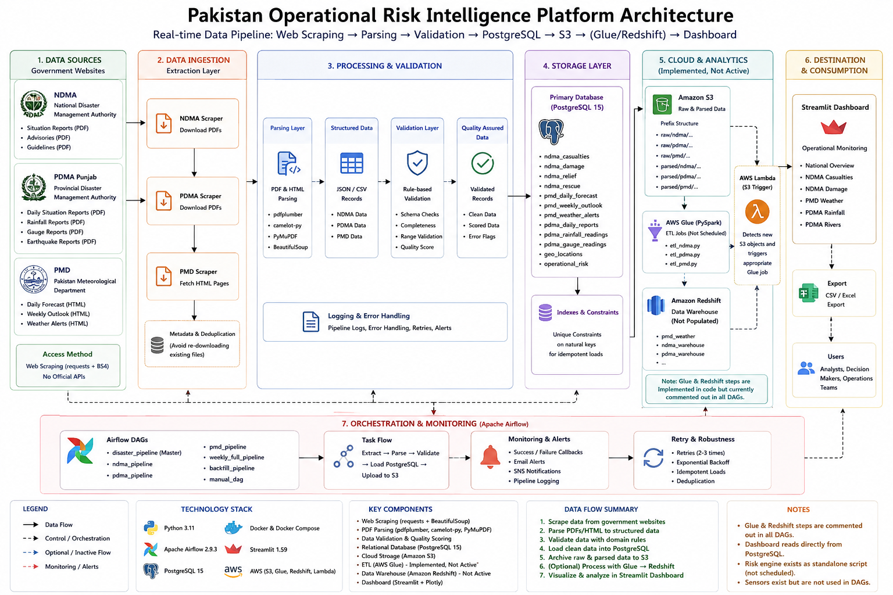

# 🇵🇰 Pakistan Operational Risk Intelligence Platform

An automated data engineering platform for scraping, parsing, validating, storing, and visualizing disaster, weather, rainfall, and river/hydrology reports published by Pakistani government authorities.


---

## Overview

Pakistan is regularly affected by floods, monsoon rainfall, and other disaster events. The authorities responsible for tracking them — **NDMA** (National Disaster Management Authority), **PDMA Punjab** (Provincial Disaster Management Authority), and **PMD** (Pakistan Meteorological Department) — publish this information as PDF situation reports and public web pages, not as structured APIs.

This platform closes that gap. It scrapes those PDF reports and HTML pages on a scheduled basis, extracts structured data from them (tables inside PDFs, HTML tables, forecast text), validates it against domain-specific rules, loads it into PostgreSQL, and archives raw and parsed files to Amazon S3. A Streamlit dashboard then provides an operational view of casualties, infrastructure damage, weather forecasts and alerts, rainfall readings, and river gauge levels.

The project is built as a learning-oriented, end-to-end data engineering exercise: scraping → parsing → validation → orchestration → storage → visualization, with an additional cloud data-warehouse layer (AWS Glue + Redshift) implemented in code as an optional extension.

> **Current Status:** This is a **development-stage** project, not a production deployment. The scraping → parsing → validation → PostgreSQL → S3 path runs on a **live, scheduled Airflow pipeline**. The AWS Glue and Amazon Redshift steps are **fully implemented in code** but their Airflow tasks are **currently commented out** in every DAG — they are not part of the active scheduled pipeline. See [AWS Integration](#-aws-integration) and [Known Limitations](#-known-limitations--implementation-status) for details.

---

## Table of Contents

- [Overview](#overview)
- [System Architecture](#-system-architecture)
- [Data Sources](#-data-sources)
- [Features](#-features)
- [Airflow Orchestration](#-airflow-orchestration)
- [Database Schema](#-database-schema)
- [AWS Integration](#-aws-integration)
- [Streamlit Dashboard](#-streamlit-dashboard)
- [Project Structure](#-project-structure)
- [Tech Stack](#-tech-stack)
- [Getting Started](#-getting-started)
- [Configuration](#-configuration)
- [Running the Pipeline](#-running-the-pipeline)
- [Data Validation & Quality](#-data-validation--quality)
- [Known Limitations](#-known-limitations--implementation-status)
- [License](#-license)

---

## 🏗️ System Architecture

<p align="center">
  
</p>

### Active pipeline

This is the flow that Apache Airflow actually schedules and runs today:

```
Government Sources (NDMA / PDMA Punjab / PMD)
        ↓
Extraction   (requests + BeautifulSoup scrapers)
        ↓
Parsing      (pdfplumber / camelot-py / PyMuPDF)
        ↓
Validation   (schema · completeness · quality score)
        ↓
PostgreSQL 15
        ↓
Amazon S3    (raw + parsed archival)
        ↓
Streamlit Dashboard   (reads PostgreSQL directly)
```

Apache Airflow orchestrates every step of this flow — scheduling, retries, and success/failure callbacks.

### Cloud warehouse extension — implemented, not active

The codebase also includes a complete second-stage cloud ETL layer:

```
Amazon S3
        ↓
AWS Glue (PySpark ETL)
        ↓
Amazon Redshift
```

> **Implemented in the codebase but currently not part of the active scheduled pipeline.** The Glue and Redshift-verification tasks exist in every domain DAG's source file, but are commented out of the task graph. PostgreSQL and S3 remain the actual system of record.

---

## 📡 Data Sources

All three sources are scraped directly, since none of them publish an official API.

| Authority | Data Collected | Format / Source | Role in the Platform |
|---|---|---|---|
| **NDMA** | Deaths, injured, houses damaged, roads/bridges damaged, livestock lost, relief distributed, persons rescued | Sitreps, advisories, guidelines (PDF) — `ndma.gov.pk` | Disaster impact tracking, per province, per situation report |
| **PDMA Punjab** | Daily situation reports, rainfall readings (mm) per station, river gauge levels, earthquake reports | PDF reports — `pdma.punjab.gov.pk` | Rainfall and river/hydrology monitoring |
| **PMD** | Daily city forecasts (temperature, humidity, 3-day outlook), weekly outlook, active weather alerts | HTML pages — `nwfc.pmd.gov.pk`, `pmd.gov.pk` | Weather forecasting and alerting |

---

## ✨ Features

### Data Ingestion
- Custom `HTTPClient` + `BeautifulSoup` scrapers per source (`scripts/extraction/`), with retry/backoff handling.
- Download de-duplication via a metadata JSON file (`common/metadata.py`) so already-downloaded PDFs aren't re-fetched.
- Source-specific extractors: `extract_ndma.py`, `extract_pdma.py`, `extract_pmd.py`.

### Data Processing
- PDF table extraction using `pdfplumber`, `camelot-py`, and `PyMuPDF` (`scripts/parsing/common/`).
- Domain-specific parsers that turn raw PDFs/HTML into structured records: `parse_ndma.py`, `parse_pdma.py` / `parse_rainfall.py` / `parse_gauge.py`, and a `pmd/` sub-package (`daily_parser.py`, `weekly_parser.py`, `alerts_parser.py`).
- Text-cleaning utilities to normalize province/station names and numeric fields scraped from inconsistent PDF layouts.

### Data Validation
- A dedicated `validation/` package with per-source rule sets: `ndma/`, `pdma/`, `pmd/` (schema checks, completeness checks, quality scoring).
- Shared field-level rules in `validation/rules.py` (e.g. temperature/humidity range checks).
- Validation runs **inside the parsers themselves**, so invalid records are flagged before they reach PostgreSQL.

### Data Storage
- PostgreSQL 15, with one table per report type (see [Database Schema](#-database-schema)).
- Idempotent loads via `UNIQUE` constraints on natural keys (e.g. report number, date, province) so re-running a DAG does not duplicate rows.

### Cloud Integration
- Amazon S3 upload of raw and parsed files, idempotent via a `HEAD` check before upload (`aws/s3/upload.py`).
- AWS Glue ETL job definitions and PySpark scripts that read from S3 and write into Amazon Redshift — implemented, not scheduled.
- Amazon Redshift table DDL and an AWS Lambda function that would route new S3 objects to the matching Glue job — implemented, not scheduled.

### Orchestration
- Seven Apache Airflow DAGs (see [Airflow Orchestration](#-airflow-orchestration)), containerized with Docker Compose.
- Retries with backoff, `catchup=False`, `max_active_runs=1`, and success/failure callbacks on every DAG.

### Dashboard
- Multi-page Streamlit app with a national overview and five domain-specific analytics pages.
- CSV/Excel export on every page, built from `pandas`/`openpyxl`.
- Auto-refresh every 60 seconds via `streamlit-autorefresh`.

### Monitoring
- Airflow success/failure callbacks and a pipeline logger recording run status.
- SNS-based alerting hook and an email helper for notifications.
- Standalone, manually-run NDMA data-quality audit scripts (`scripts/audit/`) — not scheduled by any DAG.

---

## ⏱️ Airflow Orchestration

| DAG ID | Purpose | Schedule | Main Stages |
|---|---|---|---|
| `disaster_pipeline` | Master DAG — triggers the NDMA, PDMA, and PMD pipelines in sequence | Every 6 hours (`0 */6 * * *`) | Trigger `ndma_pipeline` → `pdma_pipeline` → `pmd_pipeline` |
| `ndma_pipeline` | NDMA disaster-report pipeline | Daily at 05:00 | Extract → Parse → Build dataset → Load PostgreSQL → Upload raw to S3 |
| `pdma_pipeline` | PDMA rainfall/gauge/report pipeline | Every 6 hours | Extract → Parse → Load PostgreSQL → Upload raw + parsed to S3 |
| `pmd_pipeline` | PMD weather pipeline | Every 6 hours | Extract → Validate → Load PostgreSQL → Upload raw to S3 |
| `weekly_full_pipeline` | Full weekly re-run across all sources | Weekly | Extract all → Parse all → Load PostgreSQL → Upload all to S3 |
| `backfill_pipeline` | Re-parses already-downloaded raw files | Manual trigger only | Re-parse → Reload PostgreSQL → Re-upload to S3 |
| `manual_dag` | Ad-hoc, on-demand pipeline run | Manual trigger only | Extract → Parse → Load → Upload |

All DAGs share `retries=2–3` with a 5-minute retry delay, `catchup=False`, `max_active_runs=1`, and `on_success_callback` / `on_failure_callback` hooks (`pipeline/utils/task_callbacks.py`).

Airflow runs via **Docker Compose**: a `postgres:15` container (also used as the Airflow metadata database), an `airflow-init` job, `airflow-webserver` (port `8088`), and `airflow-scheduler`, all built from the project's own `Dockerfile` (`apache/airflow:2.9.3-python3.11`).

---

## 🗄️ Database Schema

**Active application tables** (created by `scripts/database/create_tables.py`, `create_pmd_tables.py`, `create_pdma_tables.py`, `create_geo_tables.py`, `create_risk_tables.py`, and loaded by the live pipeline):

| Table | Domain | Purpose / Key Fields |
|---|---|---|
| `ndma_casualties` | NDMA | `report_number`, `report_date`, `province`, `deaths`, `injured` |
| `ndma_damage` | NDMA | `report_date`, `province`, `roads_km`, `bridges`, `houses_total`, `livestock` |
| `ndma_relief` | NDMA | `report_date`, `province`, relief item/quantity |
| `ndma_rescue` | NDMA | `report_date`, `province`, `persons_rescued` |
| `pmd_daily_forecast` | PMD | `city`, `category`, `max_temperature`, `humidity`, `day1`–`day3` forecast, `scraped_at` |
| `pmd_weekly_outlook` | PMD | Weekly forecast text per region |
| `pmd_weather_alerts` | PMD | `alert_type`, `severity`, `duration`, `regions` (jsonb), `forecast`, `scraped_at` |
| `pdma_daily_reports` | PDMA | Daily situation report fields |
| `pdma_rainfall_readings` | PDMA | `report_date`, `station`, `rainfall_mm` |
| `pdma_gauge_readings` | PDMA | `report_datetime`, `station`, `river`, `current_level_ft`, `danger_level_ft`, `discharge_cusecs`, `flow_status` |
| `geo_locations` | Shared | `name`, `name_alt`, `location_type`, `province` — maps PMD cities to provinces |
| `operational_risk` | Risk Engine | Combined rainfall/river/disaster risk score, written by the standalone `risk_engine.py` (not by a DAG) |

Every write-heavy table has a `UNIQUE` constraint on its natural key (report number/date/province, or station) so pipeline re-runs upsert rather than duplicate, plus indexes on `report_date`/`province` for the dashboard's query patterns.

**Standalone / unused tables:**

| Item | Status |
|---|---|
| `scripts/warehouse/` star schema (`dim_date`, `dim_province`, `dim_river`, `dim_station`, `fact_ndma_casualties`, `fact_ndma_damage`, `fact_pdma_rainfall`, `fact_pdma_gauge`) | Standalone loader scripts — not called by any DAG or by the dashboard |
| `PDMAReport` model in `scripts/database/models.py` | Legacy SQLAlchemy model with no corresponding table in `create_tables.py` — dead code |

---

## ☁️ AWS Integration

| Component | Implementation | Status |
|---|---|---|
| **Amazon S3** | `aws/s3/upload.py` — idempotent upload of raw and parsed files, invoked from every DAG's `upload_raw` task | **Active** |
| **AWS Glue** | `aws/glue/create_crawlers.py`, `create_jobs.py`, and PySpark job scripts `aws/glue/scripts/etl_ndma.py` / `etl_pdma.py` / `etl_pmd.py` that read from S3 and write to Redshift | Implemented, **not scheduled** |
| **Amazon Redshift** | `aws/redshift/create_tables.py`, `setup.py` — table DDL and connection setup via `redshift_connector` | Implemented, **not scheduled** |
| **AWS Lambda** | `aws/lambda/s3_trigger.py`, `deploy.py` — routes new S3 objects to the matching Glue job by key prefix | Implemented, **not scheduled** |
| **Helper utilities** | `pipeline/helpers/aws_helper.py`, `redshift_helper.py` — `start_glue_job`, `wait_for_glue_job`, Redshift query/verify helpers, already imported by the DAGs | Implemented, **not scheduled** |

In every domain DAG (`ndma_dag.py`, `pdma_dag.py`, `pmd_dag.py`, `weekly_dag.py`, `backfill_dag.py`, `manual_dag.py`), the Glue and Redshift-verification tasks exist in source but are commented out of the task graph, e.g.:

```python
# glue = PythonOperator(
#     task_id="glue_etl",
#     python_callable=glue_etl,
# )
# verify = PythonOperator(
#     task_id="verify_redshift",
#     python_callable=verify_redshift,
# )
...
extract >> parse >> analytics >> postgres >> raw
# >> glue
# >> verify
```

**Implemented in the codebase but currently not part of the active scheduled pipeline.** PostgreSQL and S3 are the real, currently-running system of record.

---

## 📊 Streamlit Dashboard

`dashboard/Home.py` is the multipage app entrypoint, with `dashboard/pages/` supplying five detail pages:

| Page | Description |
|---|---|
| **Home** | National KPI strip, executive situation summary, national alert center, compact per-domain snapshots, and global filters |
| **NDMA Casualties** | Deaths and injured, by province and over time |
| **NDMA Damage** | Roads, bridges, houses, and livestock damage by province |
| **PMD Weather** | City forecasts, temperature/humidity trends, and active weather alerts |
| **PDMA Rainfall** | Rainfall readings by station, aggregated by time period |
| **PDMA Rivers** | River gauge levels with danger/watch/normal risk classification |

Supporting structure:

- `dashboard/db.py` — the single PostgreSQL data-access layer (SQLAlchemy engine, one function per query, `st.cache_data`/`st.cache_resource` caching).
- `dashboard/components/` — header, sidebar, global filters, KPI cards, alerts, footer.
- `dashboard/sections/` + `dashboard/charts/` — reusable disaster/weather/hydrology sections and their Plotly chart builders.
- `dashboard/styles/` — the `style.css` design system and `theme.py` loader.

> The dashboard is **not** included as a service in `docker-compose.yml`; it is run separately with `streamlit run` (see [Getting Started](#-getting-started)).

---

## 📁 Project Structure

```
.
├── dashboard/               # Streamlit application
│   ├── Home.py
│   ├── db.py
│   ├── pages/                # NDMA Casualties, NDMA Damage, PMD Weather, PDMA Rainfall, PDMA Rivers
│   ├── components/           # header, sidebar, filters, KPI cards, alerts, footer
│   ├── sections/ + charts/    # reusable page sections and Plotly chart builders
│   └── styles/                # style.css design system
│
├── scripts/                 # Data engineering scripts (not Airflow-specific)
│   ├── extraction/            # NDMA / PDMA / PMD scrapers
│   ├── parsing/                # PDF/HTML → structured JSON/CSV
│   ├── database/               # table DDL + loaders (PostgreSQL)
│   ├── warehouse/               # star-schema dim/fact loaders (standalone, unused by DAGs)
│   ├── risk_engine/              # rule-based operational risk score (standalone)
│   └── audit/                     # manual NDMA data-quality audit scripts
│
├── pipeline/                 # Airflow project
│   ├── dags/                    # 7 DAGs
│   ├── helpers/                   # script_runner, aws_helper, redshift_helper, email_helper
│   ├── sensors/                     # standalone HTTP "new PDF" checkers (not wired into DAGs)
│   ├── utils/                        # callbacks, logging, data-quality, SNS alerting
│   └── config/                        # DAG default args, Airflow setup helper
│
├── validation/                # Per-source schema / completeness / score rules
├── config/                    # Shared settings, DB engine, AWS config, logging, paths
├── aws/                       # S3 upload/download, Glue jobs+scripts, Redshift DDL, Lambda
│
├── architecture.png            # Architecture diagram (referenced in this README)
├── Dockerfile                  # Airflow image (apache/airflow:2.9.3-python3.11)
├── docker-compose.yml           # postgres + airflow-init + airflow-webserver + airflow-scheduler
├── requirements.txt              # Dashboard / general Python environment
├── airflow_requirements.txt       # Installed inside the Airflow Docker image
└── LICENSE                         # MIT
```

---

## 🧰 Tech Stack

| Category | Technology |
|---|---|
| **Language** | Python 3.11 |
| **Orchestration** | Apache Airflow 2.9.3 (LocalExecutor) |
| **Containerization** | Docker, Docker Compose |
| **Database** | PostgreSQL 15 (SQLAlchemy 2.0, psycopg2) |
| **Scraping** | `requests`, `BeautifulSoup4`, `lxml` |
| **PDF Processing** | `pdfplumber`, `camelot-py`, `PyMuPDF`, `pypdfium2` |
| **Cloud** | Amazon S3 (`boto3`), AWS Glue (PySpark), Amazon Redshift (`redshift_connector`) — Glue/Redshift implemented, not scheduled |
| **Dashboard** | Streamlit 1.59, Plotly, `streamlit-autorefresh` |
| **Data Processing** | pandas, numpy, openpyxl |

---

## 🚀 Getting Started

### Prerequisites
- Docker and Docker Compose
- Python 3.11 (for running the dashboard and any script outside Docker)
- An AWS account and credentials — only needed for S3 upload or if you choose to enable Glue/Redshift

### 1. Clone the repository
```bash
git clone <this-repository>
cd <this-repository>
```

### 2. Configure environment variables
```bash
cp .env.example .env   # create your own .env — see Configuration below; no example file ships in the repo
```

### 3. Start Airflow and PostgreSQL
```bash
docker compose up -d --build
```
- Airflow webserver: `http://localhost:8088` (default login created by `airflow-init`: `admin` / `admin`)
- PostgreSQL: exposed on host port `5433` (container port `5432`)

### 4. Create the database schema
```bash
python scripts/database/create_tables.py
python scripts/database/create_pmd_tables.py
python scripts/database/create_pdma_tables.py
python scripts/database/create_geo_tables.py
python scripts/database/create_risk_tables.py
```

### 5. Trigger a pipeline
In the Airflow UI, un-pause and trigger `disaster_pipeline` (runs NDMA → PDMA → PMD end to end), or trigger `ndma_pipeline` / `pdma_pipeline` / `pmd_pipeline` individually.

### 6. Run the dashboard
```bash
pip install -r requirements.txt
streamlit run dashboard/Home.py
```
By default it connects to `localhost:5433` (the Docker-Compose-published Postgres port), matching `config/config/database.py`'s local/Docker auto-detection.

---

## ⚙️ Configuration

Configuration is read across `config/config/*.py`, `pipeline/helpers/*.py`, and `docker-compose.yml`. No `.env.example` ships in this repository — create your own `.env` with the following structure (placeholders only — never commit real credentials):

```env
# PostgreSQL (also used as the Airflow metadata DB)
DB_USER=your_db_user
DB_PASSWORD=your_db_password
DB_NAME=your_db_name

# Airflow (docker-compose.yml expects this in .env.docker)
AIRFLOW__WEBSERVER__SECRET_KEY=your_secret_key

# AWS (only required for S3 upload / Glue / Redshift)
AWS_REGION=
AWS_ACCESS_KEY_ID=
AWS_SECRET_ACCESS_KEY=
S3_BUCKET=

# Redshift (only required if you re-enable the Glue/Redshift DAG tasks)
REDSHIFT_HOST=
REDSHIFT_PORT=5439
REDSHIFT_DB=your_redshift_db
```

`config/config/database.py` auto-detects whether it is running inside a Docker container (`/.dockerenv`) and switches between `postgres:5432` (in-container) and `localhost:5433` (host) automatically — no manual host/port toggling needed.

> ⚠️ Never commit real AWS keys, database passwords, or secrets to this repository. Use `.env` (git-ignored) or a secrets manager.

---

## ▶️ Running the Pipeline

Every script under `scripts/` is also runnable standalone, since each DAG task simply calls it via `pipeline/helpers/script_runner.run_script()`. This is useful for local testing:

```bash
# Extraction
python scripts/extraction/extract_ndma.py sitreps
python scripts/extraction/extract_pdma.py
python scripts/extraction/extract_pmd.py

# Parsing
python scripts/parsing/parse_ndma.py
python scripts/parsing/build_ndma_dataset.py
python scripts/parsing/parse_pdma.py

# Load into PostgreSQL
python scripts/database/load_ndma.py
python scripts/database/load_pdma.py
python scripts/database/load_pmd.py

# Upload to S3
python aws/s3/upload.py raw
```

---

## ✅ Data Validation & Quality

- `validation/rules.py` — shared field-level checks (e.g. `valid_temperature`, `valid_humidity`, `valid_city`), used by `validation/validator.py::validate_weather()`.
- `validation/<source>/schema.py`, `completeness.py`, `score.py` — per-source (NDMA, PDMA, PMD) structural checks and a numeric completeness/quality score.
- Validation is called **from inside the parsers themselves** (`parse_ndma.py`, `parse_pdma.py`, `pmd/daily_parser.py`), so invalid records are flagged as part of the normal pipeline run, not as a separate offline job.
- `pipeline/utils/data_quality.py` performs a lighter-weight sanity check (non-empty JSON output) between parsing and loading.
- `scripts/audit/check_ndma.py` and `ndma_data_quality_audit.py` are additional, manually-run NDMA-specific audits — not scheduled by any DAG.

---

## ⚠️ Known Limitations / Implementation Status

- **Glue and Redshift are implemented but inactive.** The Python/PySpark code, table DDL, and Airflow helper functions are complete, but the corresponding tasks are commented out in every DAG. PostgreSQL + S3 remain the actual, currently-running system of record.
- **The star-schema warehouse (`scripts/warehouse/`) is unused.** Its dimension/fact loaders exist but are not called by any DAG, script, or the dashboard.
- **The risk engine (`scripts/risk_engine/risk_engine.py`) is not scheduled.** It computes and can write to `operational_risk`, but must currently be run manually.
- **Sensors (`pipeline/sensors/`) are standalone scripts, not Airflow Sensor operators.** No DAG imports them; "new PDF" detection is not currently automatic.
- **`scripts/database/models.py`** defines a `PDMAReport` SQLAlchemy model / `pdma_reports` table with no corresponding table in `create_tables.py` — leftover, unused code.
- **The dashboard is not containerized** in `docker-compose.yml`; it must be run separately with `streamlit run`.
- **No automated test suite** is currently present in the repository.
- This project is a **development-stage** platform intended for learning and portfolio purposes, and has not been hardened for production use.

---

## 📄 License

MIT License — see [LICENSE](LICENSE). 
