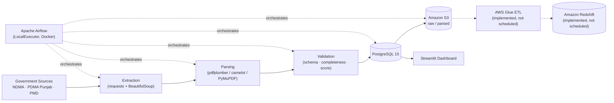

# Pakistan Operational Risk Intelligence Platform

A data engineering platform that scrapes, parses, validates, stores, and visualizes disaster, weather, rainfall, and river/hydrology reports published by three Pakistani government authorities — **NDMA**, **PDMA Punjab**, and **PMD** — on an automated Apache Airflow schedule, with a Streamlit dashboard for operational monitoring.


> **Status note:** This is a working development-stage project, not a hardened production deployment. The scraping/parsing/PostgreSQL/S3 path runs on a live Airflow schedule; the AWS Glue and Redshift steps exist as complete, runnable code but are currently **commented out** in every DAG's task graph (see [AWS Glue & Redshift](#7-aws-glue--redshift) below) — this README documents that distinction explicitly rather than implying a fully active cloud warehouse.

---

## Table of Contents

1. [Overview](#1-overview)
2. [Key Objectives](#2-key-objectives)
3. [Features](#3-features)
4. [System Architecture](#4-system-architecture)
5. [Data Sources](#5-data-sources)
6. [Database Schema](#6-database-schema)
7. [AWS Glue & Redshift](#7-aws-glue--redshift)
8. [Airflow Orchestration](#8-airflow-orchestration)
9. [Streamlit Dashboard](#9-streamlit-dashboard)
10. [Project Structure](#10-project-structure)
11. [Tech Stack](#11-tech-stack)
12. [Getting Started](#12-getting-started)
13. [Configuration (`.env`)](#13-configuration-env)
14. [Running the Pipeline](#14-running-the-pipeline)
15. [Data Validation & Quality](#15-data-validation--quality)
16. [Known Limitations](#16-known-limitations)
17. [License](#17-license)

---

## 1. Overview

Pakistan is exposed to recurring floods, monsoon rainfall, and disaster events, and the authorities that track them — NDMA (National Disaster Management Authority), PDMA Punjab (Provincial Disaster Management Authority), and PMD (Pakistan Meteorological Department) — publish this information as **PDF situation reports and public web pages**, not as structured APIs.

This platform closes that gap. It scrapes those PDF reports and HTML pages on a recurring schedule, extracts structured data from them (tables inside PDFs, HTML tables, forecast text), validates it against basic domain rules, loads it into PostgreSQL, and archives the raw and parsed files to Amazon S3. A Streamlit dashboard then gives an operational view of casualties, infrastructure damage, weather forecasts/alerts, rainfall readings, and river gauge levels.

Data monitored:

- **Disaster impact** (NDMA): deaths, injured, houses damaged, roads/bridges damaged, livestock lost, relief items distributed, persons rescued — per province, per situation report.
- **Weather** (PMD): daily city forecasts (temperature, humidity, 3-day outlook), weekly outlook, and active weather alerts/advisories.
- **Rainfall** (PDMA Punjab): rainfall readings (mm) per monitoring station.
- **River / hydrology** (PDMA Punjab): river gauge readings (current level, danger level, discharge, flow status) per station.

## 2. Key Objectives

Objectives that are actually implemented in the codebase:

- Automated **web scraping** of NDMA, PDMA Punjab, and PMD public pages (`scripts/extraction/`).
- **PDF/HTML parsing** of situation reports, rainfall/gauge tables, and forecast pages into structured JSON/CSV (`scripts/parsing/`).
- **Rule-based data validation** (schema, completeness, and a numeric quality score per record) before/around loading (`validation/`).
- **Centralized relational storage** in PostgreSQL, with dedicated tables per data domain (`scripts/database/`).
- **Cloud archival** of raw and parsed files to Amazon S3 (`aws/s3/`), invoked from Airflow.
- **Scheduled orchestration** of the whole extract → parse → load → archive flow via Apache Airflow DAGs (`pipeline/dags/`), containerized with Docker Compose.
- An **operational Streamlit dashboard** (`dashboard/`) with a national overview page and five dedicated analytics pages (NDMA Casualties, NDMA Damage, PMD Weather, PDMA Rainfall, PDMA Rivers).
- A **rule-based operational risk score** combining rainfall, river, and disaster signals into a single `operational_risk` table (`scripts/risk_engine/risk_engine.py`) — implemented as a standalone script, not currently scheduled by any DAG.

Objectives that exist as code but are **not part of the active scheduled flow** (see [Known Limitations](#16-known-limitations)):

- AWS Glue ETL jobs and Amazon Redshift warehouse loading — fully coded, wired up only through commented-out Airflow tasks.
- A star-schema data warehouse (`scripts/warehouse/`: `dim_date`, `dim_province`, `dim_river`, `dim_station`, `fact_ndma_casualties`, `fact_ndma_damage`, `fact_pdma_rainfall`, `fact_pdma_gauge`) — standalone loader scripts, not invoked from any DAG.

## 3. Features

### Data Ingestion
- Custom `HTTPClient` + `BeautifulSoup` scrapers per source (`scripts/extraction/common/`), with retry/backoff handling and download de-duplication via a metadata JSON file (`common/metadata.py`) so already-downloaded PDFs aren't re-fetched.
- Source-specific extractors: `extract_ndma.py` (sitreps/advisories/guidelines PDFs), `extract_pdma.py` (daily/rainfall/gauge/earthquake report PDFs), `extract_pmd.py` (daily forecast, weekly outlook, weather alerts).

### Data Processing / Parsing
- PDF table extraction using `pdfplumber` / `camelot-py` / `PyMuPDF` (`scripts/parsing/common/pdf_table_reader.py`, `pdf_reader.py`).
- Domain-specific parsers that turn raw PDFs/HTML into structured records: `parse_ndma.py` + `build_ndma_dataset.py`, `parse_pdma.py` / `parse_pdma_daily.py` / `parse_rainfall.py` / `parse_gauge.py`, and a `pmd/` sub-package (`daily_parser.py`, `weekly_parser.py`, `alerts_parser.py`).
- Text cleaning utilities (`text_cleaner.py`) to normalize province/station names and numeric fields scraped from inconsistent PDF layouts.

### Data Validation
- A dedicated `validation/` package with per-source rule sets: `ndma/schema.py`, `ndma/completeness.py`, `ndma/score.py` (and equivalents for `pdma/` and `pmd/`), plus shared `rules.py` (e.g. temperature/humidity range checks) and a numeric-value `translator.py`.
- Called directly from the parsing scripts (`parse_ndma.py`, `parse_pdma.py`, `pmd/daily_parser.py`), so bad records are flagged before they reach PostgreSQL.

### Data Storage
- PostgreSQL 15 (via Docker, also used as the Airflow metadata database) with one table per report type: `ndma_casualties`, `ndma_damage`, `ndma_relief`, `ndma_rescue`, `pmd_daily_forecast`, `pmd_weekly_outlook`, `pmd_weather_alerts`, `pdma_daily_reports`, `pdma_rainfall_readings`, `pdma_gauge_readings`, plus a `geo_locations` lookup table and an `operational_risk` table.
- Idempotent loads via `UNIQUE` constraints (e.g. `UNIQUE(report_number, report_date, province)`) so re-running a DAG doesn't duplicate rows.
- `scripts/database/models.py` additionally defines a legacy SQLAlchemy `PDMAReport` model that does not correspond to any table in `create_tables.py` — dead/unused code, not part of the live schema.

### Cloud Integration
- Amazon S3 upload of raw and parsed files, idempotent (skips files that already exist via a `HEAD` check) — `aws/s3/upload.py`, invoked from every DAG's `upload_raw` task.
- AWS Glue ETL job definitions and PySpark scripts (`aws/glue/scripts/etl_ndma.py`, `etl_pdma.py`, `etl_pmd.py`) that read from S3 and write into Amazon Redshift.
- Amazon Redshift table DDL (`aws/redshift/create_tables.py`) and a Lambda function (`aws/lambda/s3_trigger.py`) that routes new S3 objects to the correct Glue job by key prefix.
- **These three are implemented but not currently triggered by the scheduler** — see [AWS Glue & Redshift](#7-aws-glue--redshift).

### Monitoring / Operations
- Airflow success/failure callbacks (`pipeline/utils/task_callbacks.py`) and a pipeline logger (`pipeline_logger.py`, `metadata_logger.py`) recording run status.
- SNS-based alerting hook (`pipeline/utils/sns_alert.py`) and an email helper (`pipeline/helpers/email_helper.py`).
- Basic duplicate-detection utility (`pipeline/utils/duplicate_checker.py`) and JSON-output sanity checks (`pipeline/utils/data_quality.py`).
- Standalone data-quality audit scripts for NDMA (`scripts/audit/check_ndma.py`, `ndma_data_quality_audit.py`) — not scheduled, run manually.

### Dashboard
- Multi-page Streamlit app (`dashboard/`) — see [Streamlit Dashboard](#9-streamlit-dashboard) for detail.
- Shared design system (`dashboard/styles/style.css` + `theme.py`) providing a consistent dark/light-aware card, chart, and table styling across every page.

### Export / Reporting
- CSV/Excel export buttons on every dashboard page and section, built from `pandas.DataFrame.to_csv()` / `openpyxl`-backed Excel writers — no separate reporting service.

## 4. System Architecture

The **currently active** flow (what the Airflow scheduler actually runs, per the un-commented tasks in each DAG):

```
Government Websites (NDMA / PDMA Punjab / PMD)
        │  HTTP scrape (requests + BeautifulSoup)
        ▼
Raw PDFs / HTML  (data/raw/<source>/...)
        │  pdfplumber / camelot-py / PyMuPDF + BeautifulSoup
        ▼
Parsed structured data (JSON/CSV, data/parsed/<source>/...)
        │  validation/ rule checks (schema, completeness, score)
        ▼
PostgreSQL 15  (ndma_*, pmd_*, pdma_* tables)
        │
        ▼
Amazon S3  (raw/<source>/..., parsed/<source>/...)
        │
        ▼
Streamlit Dashboard  (reads PostgreSQL directly, via dashboard/db.py)
```

Apache Airflow (running in Docker, `LocalExecutor`, backed by its own PostgreSQL metadata DB) orchestrates every step above on a schedule, and also implements success/failure callbacks and retries.

The **implemented-but-inactive** cloud warehouse extension (code exists, DAG tasks commented out):

```
Amazon S3 ──▶ AWS Glue (PySpark ETL) ──▶ Amazon Redshift (pmd_weather, etc.)
     │
     └─▶ AWS Lambda (S3 event trigger) ──▶ starts the matching Glue job
```



*(Dotted arrows: implemented in code but disabled in the current DAG task graph.)*

## 5. Data Sources

All three sources are scraped, not consumed via an official API (none of the three publish one):

| Authority | Reports scraped | Base URL |
|---|---|---|
| **NDMA** | Sitreps, advisories, guidelines (PDF) | `ndma.gov.pk/sitreps`, `/advisories`, `/guidelines` |
| **PDMA Punjab** | Daily situation reports, rainfall reports, gauge reports, earthquake reports (PDF) | `pdma.punjab.gov.pk/*-reports-{year}` |
| **PMD** | Daily forecast, weekly outlook (HTML tables), weather alerts | `nwfc.pmd.gov.pk/new/*.php`, `pmd.gov.pk/en/latest-weather-alerts.php` |

## 6. Database Schema

Tables actually created by `scripts/database/create_tables.py`, `create_pmd_tables.py`, `create_pdma_tables.py`, `create_geo_tables.py`, and `create_risk_tables.py`:

| Table | Domain | Key columns |
|---|---|---|
| `ndma_casualties` | NDMA | `report_number`, `report_date`, `province`, `deaths`, `injured` |
| `ndma_damage` | NDMA | `report_date`, `province`, `roads_km`, `bridges`, `houses_total`, `livestock` |
| `ndma_relief` | NDMA | `report_date`, `province`, relief item/quantity |
| `ndma_rescue` | NDMA | `report_date`, `province`, `persons_rescued` |
| `pmd_daily_forecast` | PMD | `city`, `category`, `max_temperature`, `humidity`, `day1_forecast`…`day3_forecast`, `scraped_at` |
| `pmd_weekly_outlook` | PMD | weekly forecast text per region |
| `pmd_weather_alerts` | PMD | `alert_type`, `severity`, `duration`, `regions` (jsonb), `forecast`, `scraped_at` |
| `pdma_daily_reports` | PDMA | daily situation report fields |
| `pdma_rainfall_readings` | PDMA | `report_date`, `station`, `rainfall_mm` |
| `pdma_gauge_readings` | PDMA | `report_datetime`, `station`, `river`, `current_level_ft`, `danger_level_ft`, `discharge_cusecs`, `flow_status` |
| `geo_locations` | Shared | `name`, `name_alt`, `location_type`, `province` — used to map a PMD city to its province |
| `operational_risk` | Risk engine | combined rainfall/river/disaster risk score (loaded by the standalone `risk_engine.py`, not by a DAG) |

Every write-heavy table has a `UNIQUE` constraint on its natural key (report number/date/province, or station) so pipeline re-runs upsert cleanly instead of duplicating rows, plus `report_date`/`province` indexes for the query patterns the dashboard uses.

A separate, unused star schema also exists under `scripts/warehouse/` (`dim_date`, `dim_province`, `dim_river`, `dim_station`, `fact_ndma_casualties`, `fact_ndma_damage`, `fact_pdma_rainfall`, `fact_pdma_gauge`) — these loaders are standalone scripts, not called by any DAG or by the dashboard.

## 7. AWS Glue & Redshift

The codebase includes a complete second-stage cloud ETL layer:

- `aws/glue/create_crawlers.py`, `create_jobs.py` — provision Glue crawlers/jobs from Python via `boto3`.
- `aws/glue/scripts/etl_ndma.py`, `etl_pdma.py`, `etl_pmd.py` — PySpark Glue job scripts that read from S3 and `write_to_redshift(...)` into tables such as `pmd_weather`.
- `aws/redshift/create_tables.py`, `setup.py` — Redshift DDL and connection setup (via `redshift_connector`, listed in `airflow_requirements.txt`).
- `aws/lambda/s3_trigger.py`, `deploy.py` — a Lambda that inspects new S3 keys and starts the matching Glue job (`analytics/ndma/** → etl_ndma`, `parsed/pdma/** → etl_pdma`, `raw/pmd/** → etl_pmd`).
- `pipeline/helpers/aws_helper.py` and `redshift_helper.py` — reusable helpers (`start_glue_job`, `wait_for_glue_job`, Redshift query/verify helpers) that the DAGs already import.

**However**, in every domain DAG (`ndma_dag.py`, `pdma_dag.py`, `pmd_dag.py`, `weekly_dag.py`, `backfill_dag.py`, `manual_dag.py`) the Glue and Redshift-verification tasks are present in the source but commented out, e.g.:

```python
# glue = PythonOperator(
#     task_id="glue_etl",
#     python_callable=glue_etl,
# )
# verify = PythonOperator(
#     task_id="verify_redshift",
#     python_callable=verify_redshift,
# )
...
extract >> parse >> analytics >> postgres >> raw
# >> glue
# >> verify
```

So today, PostgreSQL and S3 are the system of record; Glue/Redshift are a ready-to-enable extension, not an active part of the running pipeline.

## 8. Airflow Orchestration

Seven DAGs, defined under `pipeline/pipeline/dags/`:

| DAG id | Purpose | Schedule |
|---|---|---|
| `disaster_pipeline` | Master DAG — triggers `ndma_pipeline` → `pdma_pipeline` → `pmd_pipeline` in sequence via `TriggerDagRunOperator` | every 6 hours (`0 */6 * * *`) |
| `ndma_pipeline` | Extract → Parse → Build analytics dataset → Load PostgreSQL → Upload raw to S3 | daily at 05:00 |
| `pdma_pipeline` | Extract → Parse → Load PostgreSQL → Upload raw + parsed to S3 | every 6 hours |
| `pmd_pipeline` | Extract → Validate → Load PostgreSQL → Upload raw to S3 | every 6 hours |
| `weekly_full_pipeline` | Extract all → Parse all → Load PostgreSQL → Upload all to S3 | weekly |
| `backfill_pipeline` | Re-parses NDMA/PDMA/PMD from already-downloaded raw files, reloads PostgreSQL, re-uploads to S3 | manual trigger only |
| `manual_dag` | Ad-hoc extract → parse → load → upload, for on-demand runs | manual trigger only |

All DAGs share: `retries=2–3` with a 5-minute delay, `catchup=False`, `max_active_runs=1`, and `on_success_callback` / `on_failure_callback` hooks (`pipeline/utils/task_callbacks.py`).

Airflow itself runs via **Docker Compose** (`docker-compose.yml`): a `postgres:15` container (published on host port `5433`, used both as the Airflow metadata DB and, per `config/config/database.py`'s Docker/local auto-detection, as the application database), an `airflow-init` migration/user-creation job, `airflow-webserver` (host port `8088`), and `airflow-scheduler` — all built from the project's own `Dockerfile` (`apache/airflow:2.9.3-python3.11` base image, `airflow_requirements.txt` installed on top).

## 9. Streamlit Dashboard

`dashboard/Home.py` is the multipage app entrypoint, with `dashboard/pages/` supplying five detail pages:

| Page | Covers |
|---|---|
| Home | National KPI strip, executive situation summary, national alert center, compact per-domain snapshots, filters |
| `1_NDMA_Casualties.py` | Deaths/injured by province and over time |
| `2_NDMA_Damage.py` | Roads, bridges, houses, livestock damage by province |
| `3_PMD_Weather.py` | City forecasts, temperature/humidity trends, weather alerts |
| `4_PDMA_Rainfall.py` | Rainfall readings by station, aggregated by time period |
| `5_PDMA_Rivers.py` | River gauge levels, danger/watch/normal risk classification |

Supporting structure:

- `dashboard/db.py` — the single PostgreSQL data-access layer (SQLAlchemy engine, one function per query, `st.cache_data`/`st.cache_resource` caching); every page imports from here rather than opening its own connection.
- `dashboard/components/` — header, sidebar, global filters, KPI cards, alerts, footer.
- `dashboard/sections/` + `dashboard/charts/` — the reusable disaster/weather/hydrology sections and their Plotly chart builders, shared between Home and the detail pages.
- `dashboard/styles/` — the `style.css` design system and `theme.py` loader.
- Auto-refresh every 60 seconds (`streamlit-autorefresh`) and CSV/Excel export on every page.

The dashboard is **not** included as a service in `docker-compose.yml` — it is run separately (see [Getting Started](#12-getting-started)).

## 10. Project Structure

```
.
├── dashboard/               # Streamlit application
│   ├── Home.py
│   ├── db.py
│   ├── pages/                # 1_NDMA_Casualties, 2_NDMA_Damage, 3_PMD_Weather, 4_PDMA_Rainfall, 5_PDMA_Rivers
│   ├── components/           # header, sidebar, filters, KPI cards, alerts, footer
│   ├── sections/ + charts/    # reusable page sections and Plotly chart builders
│   └── styles/                # style.css design system
│
├── scripts/                 # Data engineering scripts (not Airflow-specific)
│   ├── extraction/            # NDMA / PDMA / PMD scrapers
│   ├── parsing/                # PDF/HTML → structured JSON/CSV
│   ├── database/               # table DDL + loaders (PostgreSQL)
│   ├── warehouse/               # star-schema dim/fact loaders (standalone, unused by DAGs)
│   ├── risk_engine/              # rule-based operational risk score (standalone)
│   └── audit/                     # manual NDMA data-quality audit scripts
│
├── pipeline/                 # Airflow project
│   ├── dags/                    # 7 DAGs (see §8)
│   ├── helpers/                   # script_runner, aws_helper, redshift_helper, email_helper
│   ├── sensors/                     # standalone HTTP "new PDF" checkers (not wired into DAGs)
│   ├── utils/                        # callbacks, logging, data-quality, SNS alerting
│   └── config/                        # DAG default args, Airflow setup helper
│
├── validation/                # Per-source schema / completeness / score rules
├── config/                    # Shared settings, DB engine, AWS config, logging, paths
├── aws/                       # S3 upload/download, Glue jobs+scripts, Redshift DDL, Lambda
│
├── Dockerfile                 # Airflow image (apache/airflow:2.9.3-python3.11)
├── docker-compose.yml          # postgres + airflow-init + airflow-webserver + airflow-scheduler
├── requirements.txt             # Dashboard / general Python environment
├── airflow_requirements.txt      # Installed inside the Airflow Docker image
└── LICENSE                        # MIT
```

## 11. Tech Stack

| Layer | Technology |
|---|---|
| Language | Python 3.11 |
| Orchestration | Apache Airflow 2.9.3 (LocalExecutor) |
| Containerization | Docker, Docker Compose |
| Database | PostgreSQL 15 (SQLAlchemy 2.0, psycopg2) |
| Scraping | `requests`, `BeautifulSoup4`, `lxml` |
| PDF parsing | `pdfplumber`, `camelot-py`, `PyMuPDF`, `pypdfium2` |
| Cloud | Amazon S3 (`boto3`), AWS Glue (PySpark), Amazon Redshift (`redshift_connector`) — Glue/Redshift not currently scheduled |
| Dashboard | Streamlit 1.59, Plotly, `streamlit-autorefresh` |
| Data handling | pandas, numpy, openpyxl |

## 12. Getting Started

### Prerequisites
- Docker and Docker Compose
- Python 3.11 (for running the dashboard and any script outside Docker)
- An AWS account + credentials, only if you intend to use S3 upload or enable Glue/Redshift

### 1. Clone and configure
```bash
git clone <this-repository>
cd <this-repository>
cp .env.example .env        # create your own — see §13, no example file ships in the repo
```

### 2. Start Airflow + PostgreSQL
```bash
docker compose up -d --build
```
- Airflow webserver: `http://localhost:8088` (default login created by `airflow-init`: `admin` / `admin`)
- PostgreSQL: exposed on host port `5433` (container port `5432`)

### 3. Create the database schema
Run once, from the project root (locally, with `requirements.txt` installed, or via `docker compose exec`):
```bash
python scripts/database/create_tables.py
python scripts/database/create_pmd_tables.py
python scripts/database/create_pdma_tables.py
python scripts/database/create_geo_tables.py
python scripts/database/create_risk_tables.py
```

### 4. Trigger a pipeline
In the Airflow UI, un-pause and trigger `disaster_pipeline` (runs NDMA → PDMA → PMD end to end), or trigger `ndma_pipeline` / `pdma_pipeline` / `pmd_pipeline` individually.

### 5. Run the dashboard
```bash
pip install -r requirements.txt
streamlit run dashboard/Home.py
```
By default it connects to `localhost:5433` (the Docker-Compose-published Postgres port), matching `config/config/database.py`'s local/Docker auto-detection.

## 13. Configuration (`.env`)

Read across `config/config/*.py`, `pipeline/helpers/*.py`, and `docker-compose.yml`. No `.env.example` ships in this repository — create one with:

```env
# PostgreSQL (also used as the Airflow metadata DB)
DB_USER=airflow
DB_PASSWORD=airflow
DB_NAME=airflow

# Airflow (docker-compose.yml expects this in .env.docker)
AIRFLOW__WEBSERVER__SECRET_KEY=change-me

# AWS (only required for S3 upload / Glue / Redshift)
AWS_REGION=
AWS_ACCESS_KEY_ID=
AWS_SECRET_ACCESS_KEY=
S3_BUCKET=

# Redshift (only required if you re-enable the Glue/Redshift DAG tasks)
REDSHIFT_HOST=
REDSHIFT_PORT=5439
REDSHIFT_DB=pakistan_operational_risk
```

`config/config/database.py` auto-detects whether it's running inside a Docker container (`/.dockerenv`) and switches between `postgres:5432` (in-container) and `localhost:5433` (host) automatically — no manual host/port toggling needed.

## 14. Running the Pipeline

Every script under `scripts/` is also runnable standalone (each DAG task just calls it via `pipeline/helpers/script_runner.run_script()`), for local testing:

```bash
# Extraction
python scripts/extraction/extract_ndma.py sitreps
python scripts/extraction/extract_pdma.py
python scripts/extraction/extract_pmd.py

# Parsing
python scripts/parsing/parse_ndma.py
python scripts/parsing/build_ndma_dataset.py
python scripts/parsing/parse_pdma.py

# Load into PostgreSQL
python scripts/database/load_ndma.py
python scripts/database/load_pdma.py
python scripts/database/load_pmd.py

# Upload to S3
python aws/s3/upload.py raw
```

## 15. Data Validation & Quality

- `validation/rules.py` — shared field-level checks (e.g. `valid_temperature`, `valid_humidity`, `valid_city`), used directly by `validation/validator.py::validate_weather()`.
- `validation/<source>/schema.py`, `completeness.py`, `score.py` — per-source (NDMA, PDMA, PMD) structural checks and a numeric completeness/quality score.
- Called from inside the parsers themselves (`scripts/parsing/parse_ndma.py`, `parse_pdma.py`, `scripts/parsing/pmd/daily_parser.py`), so invalid records are flagged as part of the normal pipeline run, not as a separate offline job.
- `pipeline/utils/data_quality.py` performs a lighter-weight sanity check (non-empty JSON output) between parsing and warehouse loading.
- `scripts/audit/check_ndma.py` and `ndma_data_quality_audit.py` are additional, manually-run NDMA-specific audits — not scheduled by any DAG.

## 16. Known Limitations

Documented explicitly, based on what the code shows rather than what it's named after:

- **Glue and Redshift are dormant.** The Python/PySpark code, table DDL, and Airflow helper functions are complete, but the corresponding tasks are commented out in every DAG. PostgreSQL + S3 is the actual, currently-running system of record.
- **The star-schema warehouse (`scripts/warehouse/`) is unused.** Its dimension/fact loaders exist but are not called by any DAG, script, or the dashboard.
- **The risk engine (`scripts/risk_engine/risk_engine.py`) is not scheduled.** It computes and can write to `operational_risk`, but must currently be run manually.
- **Sensors (`pipeline/sensors/`) are standalone scripts, not Airflow Sensor operators.** No DAG imports them; "new PDF" detection is not currently automatic.
- **`scripts/database/models.py`** defines a `PDMAReport` SQLAlchemy model / `pdma_reports` table that does not exist in `create_tables.py` — leftover/unused code.
- **The dashboard is not containerized** in `docker-compose.yml`; it must be run separately with `streamlit run`.
- No automated test suite is present in the inspected ZIP.

## 17. License

MIT License — see [LICENSE](LICENSE).
