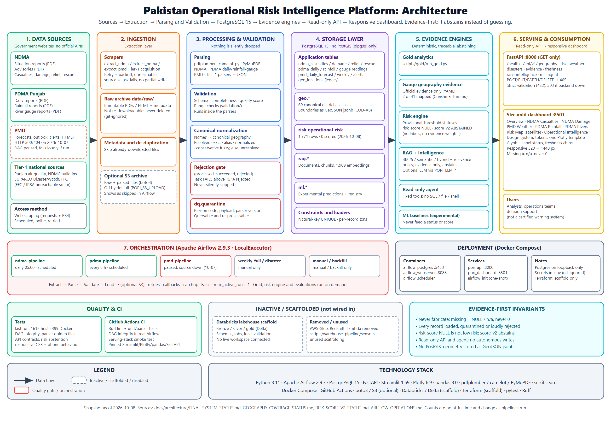

# Pakistan Operational Risk Intelligence Platform

An evidence-first data engineering platform that scrapes, parses, validates, stores, serves and visualizes disaster, weather, rainfall and river/hydrology reports published by Pakistani government authorities, and turns them into **operational risk information that says how much evidence stands behind it**.


-232F3E)


---

## Table of contents

1. [Overview](#1-overview)
2. [Guiding principles](#2-guiding-principles)
3. [System architecture](#3-system-architecture)
4. [Data sources](#4-data-sources)
5. [Features by layer](#5-features-by-layer)
6. [Airflow orchestration](#6-airflow-orchestration)
7. [Database](#7-database)
8. [Geography](#8-geography)
9. [Risk engine](#9-risk-engine)
10. [REST API](#10-rest-api)
11. [RAG, intelligence and agent](#11-rag-intelligence-and-agent)
12. [Machine learning (experimental)](#12-machine-learning-experimental)
13. [Streamlit dashboard](#13-streamlit-dashboard)
14. [Responsive design](#14-responsive-design)
15. [Repository structure](#15-repository-structure)
16. [Tech stack](#16-tech-stack)
17. [Getting started](#17-getting-started)
18. [Configuration](#18-configuration)
19. [Running the pipeline and the engines](#19-running-the-pipeline-and-the-engines)
20. [Testing, linting and CI](#20-testing-linting-and-ci)
21. [Data quality and quarantine](#21-data-quality-and-quarantine)
22. [Documentation index](#22-documentation-index)
23. [Known limitations](#23-known-limitations)
24. [Contributing rules](#24-contributing-rules)
25. [License](#25-license)

---

## 1. Overview

Pakistan is regularly affected by floods, monsoon rainfall and other disasters. The authorities that track them (**NDMA**, **PDMA Punjab** and **PMD**) publish situation reports as PDFs and public web pages, not as structured APIs. This platform closes that gap:

1. **Collects** the reports on a schedule (Airflow).
2. **Parses** tables out of PDFs and HTML into structured records.
3. **Validates** every record. Invalid or unparseable records go to a quarantine table instead of disappearing.
4. **Stores** the result in PostgreSQL 15 on one canonical administrative geography.
5. **Serves** it through a read-only FastAPI service, with a deterministic risk engine, retrieval over the report corpus, an evidence-grounded intelligence endpoint and a read-only agent.
6. **Shows** it in a Streamlit dashboard that is responsive from large desktops down to 320 px phones.

**Where evidence is insufficient the platform abstains instead of guessing.** A missing value is shown as `n/a`, never as 0; a null risk score is never presented as "low risk".

> **Status:** development-stage, evidence-first system, not a certified early-warning service. It must not be used as the sole basis for any emergency decision. See [Known limitations](#23-known-limitations).

---

## 2. Guiding principles

These rules are enforced in code, tests and review (the long form is in [`CLAUDE.md`](CLAUDE.md)).

| Principle | In practice |
|---|---|
| **Never fabricate data** | Missing coordinate/date/value is `NULL`, not a default or an interpolation. Estimates, when they exist, carry a quality flag. |
| **No silent record dropping** | Every record ends loaded, quarantined or loudly rejected. Parsers and loaders return `(processed, succeeded, rejected)` and the task **fails** above a rejection ratio (15 %). |
| **Quarantine, never `/dev/null`** | Rejections are written to `dq.quarantine` with reason code, message, parser version and timestamp. |
| **Abstain over guess** | `risk_score` is NULL everywhere and `score_v2` is ABSTAINED by design. RAG, intelligence and agent abstain when evidence is missing or irrelevant. |
| **Evidence traceability** | Every geography mapping, signal and risk row can be traced to a source document or a configuration file. |
| **Read-only serving** | The API exposes only `GET`; every write verb returns `405`. The agent has a fixed, read-only tool set (no SQL, file, shell or HTTP tools). |
| **Correctness over coverage** | One reliable pipeline over many unreliable ones; a failing source fails loudly. |

---

## 3. System architecture

<p align="center">
  
</p>

### Active flow

```
Government sources (NDMA / PDMA Punjab / PMD, plus Tier-1 national sources)
        |
Extraction     requests + BeautifulSoup scrapers, retry/backoff, download de-duplication
        |
Raw archive    data/raw/  (immutable PDFs/HTML + metadata; never re-downloadable, never deleted)
        |
Parsing        pdfplumber / camelot-py / PyMuPDF  ->  structured JSON
        |
Validation     schema · completeness · quality score  ->  loaded or dq.quarantine
        |
PostgreSQL 15  application tables, geo.*, risk.*, rag.*, ml.* schemas
        |
Gold analytics -> Risk engine (deterministic, evidence-gated)
        |
Read-only FastAPI  (geography · risk · weather · disasters · RAG · intelligence · ML · agent · evidence · freshness)
        |
Streamlit dashboard  (reads the API and PostgreSQL; responsive)
```

Apache Airflow schedules the ingestion half of this flow; the Gold build, the risk engine and the evaluation scripts are run on demand (commands in [section 19](#19-running-the-pipeline-and-the-engines)).

### Containers (Docker Compose)

| Service | Container | Port | Role |
|---|---|---|---|
| `postgres` | `airflow_postgres` | `127.0.0.1:5433` -> 5432 | PostgreSQL 15, **no PostGIS**; also the Airflow metadata database |
| `airflow-init` | `airflow_init` | n/a | One-shot DB init and admin user |
| `airflow-webserver` | `airflow_webserver` | `8088` | Airflow UI |
| `airflow-scheduler` | `airflow_scheduler` | n/a | Runs the DAGs |
| `api` | `pori_api` | `8000` (`API_PORT`) | Read-only FastAPI |
| `dashboard` | `pori_dashboard` | `8501` (`DASHBOARD_PORT`) | Streamlit app |

PostgreSQL is published on the loopback interface only. Inside the Compose network services reach it as `postgres:5432`.

### Lakehouse extension: scaffolded, not active

`databricks/` holds the planned Spark / Delta Lake bronze-silver-gold layer (schemas, jobs, notebooks, local validation). It is **not connected to a live Databricks workspace**. AWS Glue, Redshift and Lambda were removed from the repository (ADR-0001). `infrastructure/terraform/` contains Terraform scaffolding; nothing paid is deployed.

---

## 4. Data sources

| Authority | Data | Format / source | Role |
|---|---|---|---|
| **NDMA** | Deaths, injured, houses/roads/bridges damaged, livestock lost, relief, rescue; advisories | Sitrep PDFs, `ndma.gov.pk` | Disaster impact per province per report |
| **PDMA Punjab** | Daily reports, rainfall per station, river gauge readings | PDF, `pdma.punjab.gov.pk` | Rainfall and hydrology |
| **PMD** | City forecasts, weekly outlook, weather alerts | HTML, `nwfc.pmd.gov.pk`, `pmd.gov.pk` | Weather (source currently unavailable) |
| **Tier-1 national acquisition** | Punjab air quality, NDMC bulletins, SUPARCO DisasterWatch, FFC | `scripts/acquisition/` | Supplementary evidence; FFC/IRSA were unreachable during development |

None of these publish an API, so all are scraped. NDMA sitreps are **cumulative**: totals use the peak per province and trends use increments, never a sum of reports.

---

## 5. Features by layer

**Ingestion.** Per-source scrapers (`scripts/extraction/`), a shared `HTTPClient` with retry/backoff, a metadata JSON for download de-duplication, and a failure policy where an unreachable source fails the task (it never writes partial data).

**Processing.** Domain parsers (`scripts/parsing/`): NDMA, PDMA daily/rainfall/gauge, PMD daily/weekly/alerts, plus the canonical normalization layer (`pipeline/canonical/`) and the Tier-1 parsers.

**Validation.** Per-source rule sets in `validation/` (schema, completeness, quality score), invoked inside the parsers.

**Storage.** PostgreSQL 15 with natural-key `UNIQUE` constraints, per-record transactions in the loaders (one bad row cannot abort a load), and no destructive `TRUNCATE` in the loaders.

**Analytics.** Gold build (`scripts/gold/run_gold.py`), geography coverage audit, risk engine, ML feature pipeline.

**Serving.** Read-only FastAPI, dashboard, optional S3 archive of raw/parsed files (off by default).

---

## 6. Airflow orchestration

Seven DAGs exist (`pipeline/dags/`). Full detail: [`docs/architecture/AIRFLOW_OPERATIONS.md`](docs/architecture/AIRFLOW_OPERATIONS.md).

| DAG | Purpose | Schedule | Status |
|---|---|---|---|
| `ndma_pipeline` | NDMA: extract -> parse -> build dataset -> load -> S3 (optional) | daily 05:00 | scheduled |
| `pdma_pipeline` | PDMA Punjab rainfall / gauge / daily: extract -> parse -> load -> S3 (optional) | every 6 h | scheduled |
| `pmd_pipeline` | PMD forecasts, outlook, alerts | every 6 h when enabled | **disabled: source unavailable** (HTTP 500/404 on 2026-10-07); fails loudly if run |
| `weekly_full_pipeline` | Full re-run of all sources | none | manual only |
| `disaster_pipeline` | Master DAG triggering the three source DAGs | none | manual only |
| `manual_pipeline` | Ad-hoc single source (`--conf '{"source":"ndma"}'`) | none | manual only |
| `backfill_pipeline` | Re-parse downloaded raw files and reload | none | backfill only |

All DAGs use `catchup=False`, `max_active_runs=1`, retries and the callbacks in `pipeline/utils/task_callbacks.py`. S3 archiving shows as **skipped** unless `PORI_S3_UPLOAD` is enabled and credentials are valid. `ndma_pipeline` and `pdma_pipeline` were each verified end to end once; they have not been observed over many days.

---

## 7. Database

PostgreSQL 15. **No PostGIS**: the image has only the `plpgsql` extension, so boundary geometry is stored as validated GeoJSON `jsonb` with point-in-polygon done in Python (`pipeline/geo/boundaries.py`). A PostGIS migration (`db/migrations/0026b_postgis_geometry.up.sql`) exists but is a guarded no-op on this server.

**Application tables** (created by `scripts/database/create_*.py` and loaded by the pipeline): `ndma_casualties`, `ndma_damage`, `ndma_relief`, `ndma_rescue`, `pdma_daily_reports`, `pdma_rainfall_readings`, `pdma_gauge_readings`, `pmd_daily_forecast`, `pmd_weekly_outlook`, `pmd_weather_alerts`, `geo_locations`, `operational_risk`.

**Schemas added by later tasks:**

| Schema | Content | Created by |
|---|---|---|
| `dq` | `quarantine` (the original 158 rows are preserved; the scheduler adds more as it runs) | `create_dq_tables.py` |
| `geo` | `admin_unit` (69 canonical districts), `name_alias`, boundary and gauge-evidence tables | `create_geo_schema_tables.py`, migration `0026` |
| `risk` | `operational_risk` serving table (1,771 rows) | `apply_serving_migration.py` |
| `rag` | document, chunk and embedding tables (1,909 embeddings) | `apply_rag_migration.py`, migration `0030` |
| `ml` | `predictions` and model registry (experimental) | `apply_ml_migration.py` |

Migrations live in `db/migrations/` as paired `*.up.sql` / `*.down.sql`. Any schema change requires a fresh, restore-verified backup first.

The legacy star-schema scripts in `scripts/warehouse/` and the sensors in `pipeline/sensors/` are unused scaffolding kept for now; no DAG or the dashboard calls them.

---

## 8. Geography

- **Canonical hierarchy:** country, province, district (**69 districts** in `geo.admin_unit`). There is no tehsil level and no invented precision.
- **Name resolution:** `scripts/geo/resolver.py` resolves raw names by exact, alias, normalized and conservative fuzzy match. Ambiguous or unmatched names are recorded as `ambiguous`/`unresolved` in `geo.name_alias` and **never guessed**.
- **Boundaries:** COD-AB district boundaries are loaded from local files (`scripts/geo/load_boundaries.py`). Of 160 boundary districts, 69 match the canonical list; the rest are intentionally not forced.
- **Gauge geography:** station-to-district mappings are added **only from official evidence** (`config/crosswalk_evidence.yaml`, `config/gauge_station_evidence.yaml`). **2 of 41 gauge stations are mapped** (Chashma -> Mianwali, Trimmu -> Jhang); the rest stay unresolved, conflicting or secondary-only, and are never shown as geography.
- **Known data-quality items kept honest:** `ndma_relief.province` holds relief items, so it is excluded from resolution; PDMA rainfall "stations" are mostly district lists and are not attributed.

Details: [`docs/architecture/GEOGRAPHY_COVERAGE_STATUS.md`](docs/architecture/GEOGRAPHY_COVERAGE_STATUS.md), [`GAUGE_GEOGRAPHY_STATUS.md`](docs/architecture/GAUGE_GEOGRAPHY_STATUS.md), [`GEO_SERVING_LAYER_STATUS.md`](docs/architecture/GEO_SERVING_LAYER_STATUS.md).

---

## 9. Risk engine

Deterministic, evidence-gated, run by hand after new ingestion (`scripts/risk/`).

- **1,771 risk rows**, each with a **provisional-threshold status** (Critical, High, Moderate, Low, Insufficient data, No signal, No risk record).
- **`risk_score` is NULL on every row and `score_v2` is ABSTAINED by design.** There are no outcome labels and no evidence-based weights, and only 8 of 1,771 cells have the two independent signal groups a score would require. A NULL score is **not** "low risk"; the API and dashboard say so.
- `scripts/risk/audit_score_v2.py` explains the abstention; `validate_risk_output.py` checks the output; `load_risk_serving.py` upserts into `risk.operational_risk` (rows missing from a newer run are flagged `is_current = false`, never deleted).

Details: [`OPERATIONAL_RISK_ENGINE_STATUS.md`](docs/architecture/OPERATIONAL_RISK_ENGINE_STATUS.md), [`RISK_SCORE_V2_STATUS.md`](docs/architecture/RISK_SCORE_V2_STATUS.md).

---

## 10. REST API

Read-only FastAPI (`api/app/`), all under `/api/v1`, plus `/health`. Only `GET` is routed; `POST/PUT/PATCH/DELETE` return `405`. Interactive docs at `http://localhost:8000/docs`.

| Router | Endpoints |
|---|---|
| health | `GET /health` |
| geography | `/api/v1/geography/admin-units`, `/boundaries` |
| risk | `/api/v1/risk`, `/risk/latest`, `/risk/map` |
| weather | `/api/v1/weather` |
| disasters | `/api/v1/disasters` |
| evidence | `/api/v1/evidence/gauge-stations` |
| freshness | `/api/v1/freshness` (per-source latest successful snapshot, age and status) |
| rag | `/api/v1/rag/documents`, `/documents/{id}`, `/search`, `/ask` |
| intelligence | `/api/v1/intelligence/ask` |
| ml | `/api/v1/ml/predictions`, `/models` |
| agent | `/api/v1/agent/tools`, `/agent/ask` |

Validation is strict (for example, an unknown `mode` returns `422`); unavailable backends return `503`; empty results are `200` with an empty body. Details: [`docs/architecture/SERVING_STACK.md`](docs/architecture/SERVING_STACK.md).

---

## 11. RAG, intelligence and agent

All three are **traceable, read-only and abstaining**.

- **RAG** (`pipeline/rag/`, `scripts/rag/`): the NDMA/PDMA/PMD report corpus is chunked, embedded (optional embedding runtime) and searched lexically (BM25), semantically or hybrid. A relevance policy rejects off-topic retrieval, so out-of-corpus questions abstain.
- **Intelligence** (`pipeline/intelligence/`): combines the risk context, documentary evidence and the ML forecast, kept separate and labelled.
- **Agent** (`pipeline/agents/`): a multi-step, **read-only** agent with a fixed tool set; arbitrary SQL, file, shell and HTTP requests are refused (`UNSUPPORTED_REQUEST`).
- **Language model:** none is required. Without one, these endpoints return evidence only and say the model is unavailable, and the dashboard shows a clearly labelled deterministic **evidence summary** built from the retrieved facts (no generated text). To enable written answers, set `PORI_LLM_PROVIDER`, `PORI_LLM_MODEL`, `PORI_LLM_API_KEY` (and optionally `PORI_LLM_BASE_URL`) in `.env`.

Evaluation scripts: `scripts/rag/evaluate_*.py`, `scripts/agents/evaluate_agent.py`. Details: [`RAG_FOUNDATION.md`](docs/architecture/RAG_FOUNDATION.md), [`RAG_RELEVANCE_STATUS.md`](docs/architecture/RAG_RELEVANCE_STATUS.md), [`AGENT_STATUS.md`](docs/architecture/AGENT_STATUS.md).

---

## 12. Machine learning (experimental)

Baseline gauge-discharge forecasts (`scripts/forecasting/`, `scripts/ml/`, `pipeline/ml/`): leakage-safe feature engineering, chronological train/validation/test split, and a persistence baseline compared against a linear model. **Forecasts are experimental, are never fed into a status or a score, and are not validated against a real flood event.** Details: [`docs/ml/`](docs/ml), [`ML_RISK_PREDICTION_STATUS.md`](docs/architecture/ML_RISK_PREDICTION_STATUS.md).

---

## 13. Streamlit dashboard

`dashboard/Home.py` is the multipage entry point (`dashboard/pages/` holds the detail pages).

| Page | Description |
|---|---|
| **Home / Executive Overview** | Purpose, NDMA impact KPIs (peak cumulative, not sums), data and evidence coverage per domain with freshness chips, risk availability, national alert, geography coverage |
| **NDMA Casualties / Damage** | By province and over time; cumulative figures, increments, weekly progression, province-by-week heatmap |
| **PMD Weather** | The single dated forecast snapshot (no history is implied) |
| **PDMA Rainfall** | Report-by-report rainfall, intensity bands, station coverage, station-by-month heatmap |
| **PDMA Rivers** | Gauge network and geography evidence; **no level or flood-risk indicator** (the legacy level columns are not water levels) |
| **Risk Map** | Satellite-basemap choropleth with status per area (glyph + label), scored vs abstained counts, missing geometry, signal detail |
| **Operational Intelligence** | Agent, Analyze Risk and Ask Reports modes over separate backends, with an evidence overview and evidence summaries |

**Design system** (`dashboard/ui/`): one set of tokens (colour, type, spacing), one Plotly template, shared KPI/status/freshness/notice components, a satellite map builder that fits the initial view to the drawn boundaries, status always shown as glyph plus label (never colour alone), and a 200 ms motion language that respects `prefers-reduced-motion`. Details: [`docs/architecture/UI_DESIGN_SYSTEM.md`](docs/architecture/UI_DESIGN_SYSTEM.md).

**Freshness and caching:** the dashboard shows the real date of the latest successful snapshot per source, never a fake "live" badge. API calls are cached as plain dicts. Details: [`docs/architecture/FRESHNESS.md`](docs/architecture/FRESHNESS.md).

Run it with Compose (`docker compose up -d --build dashboard`) or on the host (`streamlit run dashboard/Home.py`). After changing code, restart a host `streamlit run`: a long-running process keeps old imported modules.

---

## 14. Responsive design

The whole dashboard was made responsive without changing data, API contracts or the palette, and was verified in the rendered app at 1440, 1280, 1024, 768, 600, 480, 430, 390, 375 and 320 px (a fresh load per width, measured for horizontal overflow, clipped text, small text, touch targets and chart/table widths). Streamlit scrolls inside `stMain`, so overflow is measured there; the shared CSS does **not** use `overflow-x: hidden`.

| Breakpoint | What changes |
|---|---|
| any width | Plotly logo hidden; sidebar at most 86 vw; tags and long text wrap |
| <= 1100 px | Smaller page title; legacy KPI values wrap; 11 px label floor |
| <= 820 px | Chart, filter and panel rows stack; KPI rows go two across |
| <= 768 px | Tighter padding, 44 px touch targets, 12 px label floor, Plotly toolbar hidden on ordinary charts, large map controls |
| <= 480 px | 20 px page title; long app-bar text hidden |
| <= 359 px | KPI rows one per line |
| `pointer: coarse` | 44 px targets and large map controls at any width |

`dashboard/ui/viewport.py` detects phones from the request User-Agent for the few pixel sizes CSS cannot set: charts are capped at 360 px, the range slider is dropped (the 7d/30d/90d/All buttons stay) and maps are 420 px high with the initial view fitted to the phone width. Tables scroll inside their own container. The Home page no longer forces the sidebar open (`initial_sidebar_state="auto"`).

---

## 15. Repository structure

```
.
├── api/                     Read-only FastAPI (app/routers, app/services, app/schemas, tests, Dockerfile)
├── dashboard/               Streamlit app
│   ├── Home.py, db.py, api_client.py
│   ├── pages/               7 pages (NDMA x2, PMD, PDMA x2, Risk Map, Operational Intelligence)
│   ├── ui/                  design system: tokens, charts, maps, components, shell, viewport
│   ├── sections/ charts/ components/ utils/   reusable sections, chart builders, helpers
│   └── styles/              design_system.css (shared, responsive)
├── pipeline/
│   ├── dags/                7 Airflow DAGs
│   ├── helpers/ utils/ config/   script runner, S3 helper, callbacks, data-quality, quarantine
│   ├── canonical/ geo/ gold/ risk/ rag/ intelligence/ agents/ ml/   domain packages
│   └── sensors/             unused standalone checkers (not wired into DAGs)
├── scripts/
│   ├── extraction/ parsing/ database/   scrapers, parsers, DDL and loaders
│   ├── acquisition/         Tier-1 national source acquisition
│   ├── geo/ gold/ risk/ ml/ forecasting/ rag/ agents/ lakehouse/   engines, evaluations, audits
│   ├── warehouse/           unused star-schema scaffolding
│   └── audit/               manual NDMA data-quality audits
├── validation/              Per-source schema / completeness / score rules
├── config/                  Settings, DB engine, evidence YAMLs, evaluation configs, paths
├── db/migrations/           Paired up/down SQL migrations
├── databricks/              Spark / Delta lakehouse scaffold (not connected)
├── infrastructure/terraform/  Terraform scaffold (nothing deployed)
├── aws/                     S3 upload/download only
├── data/                    raw / parsed / analytics / rejected / models / master
├── docs/                    architecture status docs, ADRs, assessment, geo, ml, source inventory
├── tests/                   pytest suites per area (+ fixtures, golden files)
├── requirements/            Pinned sets: api.txt, dashboard.txt, embeddings.txt, ci.txt
├── .github/workflows/ci.yml GitHub Actions
├── docker-compose.yml, Dockerfile   Compose stack and the Airflow image
├── CLAUDE.md                Permanent project rules
└── README.md, LICENSE
```

`data/raw/` holds government PDFs that cannot be re-downloaded: never delete it.

---

## 16. Tech stack

| Category | Technology |
|---|---|
| Language | Python 3.11 |
| Orchestration | Apache Airflow 2.9.3 (LocalExecutor) |
| Containers | Docker, Docker Compose |
| Database | PostgreSQL 15, SQLAlchemy 2, psycopg2 |
| Scraping | requests, BeautifulSoup4, lxml |
| PDF processing | pdfplumber, camelot-py, PyMuPDF, pypdfium2 |
| API | FastAPI, uvicorn, pydantic |
| Dashboard | Streamlit 1.59.2, Plotly 6.9.0, pandas 3.0.3, streamlit-autorefresh |
| ML / retrieval | scikit-learn, joblib, optional ONNX embedding runtime |
| Cloud (optional) | Amazon S3 via boto3 (off by default) |
| Lakehouse (scaffold) | Databricks, PySpark, Delta Lake |
| Quality | pytest, Ruff, detect-secrets, pre-commit |

---

## 17. Getting started

**Prerequisites:** Docker and Docker Compose; Python 3.11 for anything run outside Docker.

```bash
# 1. Clone
git clone <this-repository>
cd <this-repository>

# 2. Configure (generate real values for the secrets; see .env.example and docs/architecture/DEPLOYMENT.md)
cp .env.example .env

# 3. Start PostgreSQL, Airflow, the API and the dashboard
docker compose up -d --build

# 4. Create the schema (hand-run DDL, in this order)
python scripts/database/create_tables.py
python scripts/database/create_pmd_tables.py
python scripts/database/create_geo_tables.py
python scripts/database/create_risk_tables.py
python scripts/database/create_dq_tables.py
python scripts/database/create_geo_schema_tables.py
python scripts/geo/seed_admin_units.py
python scripts/database/apply_serving_migration.py up
python scripts/database/apply_rag_migration.py up
python scripts/database/apply_rag_migration.py up --embeddings   # migration 0030: rag.chunk_embeddings (needs 0029 above)
python scripts/database/apply_ml_migration.py up
```

The geography schema and seed must come before the three migrations (`0026` serving, `0029` RAG and `0033` ML all reference `geo.admin_unit`), and `0029` before `0030`. The first four scripts are independent legacy table creators. These scripts only create empty tables. Data is loaded afterwards: boundaries by `scripts/geo/load_boundaries.py`, risk rows by the commands in [section 19](#19-running-the-pipeline-and-the-engines), and the RAG corpus and embeddings by `scripts/rag/build_rag_corpus.py` and `scripts/rag/embed_chunks.py`.

| URL | What |
|---|---|
| `http://localhost:8501` | Dashboard |
| `http://localhost:8000/docs` | API docs (`/health` for a quick check) |
| `http://localhost:8088` | Airflow UI (default `admin` / the value of `AIRFLOW_ADMIN_PASSWORD`) |

Enable the scheduled DAGs when ready (all are created paused):

```bash
docker exec airflow_webserver airflow dags unpause ndma_pipeline   # daily
docker exec airflow_webserver airflow dags unpause pdma_pipeline   # every 6 hours
```

Only API and dashboard (no Airflow): `docker compose up -d --build postgres api dashboard`.

Dashboard on the host: `pip install -r requirements/dashboard.txt` then `streamlit run dashboard/Home.py` (it connects to `localhost:5433`).

---

## 18. Configuration

Copy [`.env.example`](.env.example) to `.env` (never commit it). Key settings:

```env
AIRFLOW__WEBSERVER__SECRET_KEY=...     # required; python -c "import secrets; print(secrets.token_hex(32))"
POSTGRES_PASSWORD=...                  # set before the first `docker compose up` of a deployment
AIRFLOW_ADMIN_PASSWORD=...

# optional S3 archive (off by default; enable with PORI_S3_UPLOAD=auto in .env.docker)
AWS_ACCESS_KEY_ID= AWS_SECRET_ACCESS_KEY= AWS_REGION= S3_BUCKET=

# optional language model for RAG / intelligence / agent answers
PORI_LLM_PROVIDER= PORI_LLM_MODEL= PORI_LLM_API_KEY= PORI_LLM_BASE_URL=

# ports (defaults shown)
# API_PORT=8000   DASHBOARD_PORT=8501
```

An optional, untracked `.env.deploy` carries the non-default `DB_PASSWORD`. `config/database.py` detects whether it runs inside Docker and switches between `postgres:5432` and `localhost:5433`. Deployment guide: [`docs/architecture/DEPLOYMENT.md`](docs/architecture/DEPLOYMENT.md).

> Never commit AWS keys, database passwords or secrets. `.env`, `*.dump` and `airflow/logs/` are git-ignored.

---

## 19. Running the pipeline and the engines

Every DAG task simply calls a script, so each step also runs standalone:

```bash
# Extraction / parsing / loading
python scripts/extraction/extract_ndma.py sitreps
python scripts/extraction/extract_pdma.py
python scripts/parsing/parse_ndma.py && python scripts/parsing/build_ndma_dataset.py
python scripts/parsing/parse_pdma.py
python scripts/database/load_ndma.py
python scripts/database/load_pdma.py

# Evidence, gold and risk (deterministic; only the last command writes to the database)
python scripts/gold/run_gold.py
python scripts/geo/run_gauge_geography.py
python scripts/risk/run_risk_engine.py
python scripts/risk/validate_risk_output.py
python scripts/risk/audit_score_v2.py
python scripts/geo/audit_coverage_task37.py
python scripts/risk/load_risk_serving.py

# Optional: archive to S3 (only if enabled and credentials are valid)
python aws/s3/upload.py raw
```

Quick API check:

```bash
curl http://localhost:8000/health
curl "http://localhost:8000/api/v1/risk/latest?admin_unit_id=30"   # risk_score null, score_v2 ABSTAINED, evidence explanation
curl http://localhost:8000/api/v1/freshness
```

---

## 20. Testing, linting and CI

```bash
ruff check .                                              # lint (pyflakes + syntax errors; see pyproject.toml)
python -m pytest --ignore=tests/test_dag_integrity.py     # host suite
docker exec -w /opt/project -e PYTHONPATH=/opt/project airflow_webserver \
    python -m pytest tests/test_dag_integrity.py tests/dags tests/geo tests/risk tests/parsers   # needs the Airflow package
```

The last full local run (host) was **1612 passed, 5 skipped**; the Docker run was **399 passed**. Coverage includes DAG integrity, parser golden files and type coercion, geography resolution, risk and score abstention, RAG relevance, API contracts, security, architecture checks, and the dashboard (design-system contrast, chart builders, responsive CSS contract, phone-size behaviour).

**Tests that need local-only files skip with an explicit reason** when those files are absent (for example the parser golden tests need PDFs under `data/raw/`, and one geography test needs the generated `gold_operational_risk.jsonl`); both locations are git-ignored. With the files present the tests run exactly as before.

**CI** (`.github/workflows/ci.yml`, on push and pull request): lint plus unit/parser/architecture tests, DAG integrity inside the real Airflow container via Compose, and a serving-stack job that builds the API image, builds the schema on an empty database and smoke-tests the endpoint contracts. `requirements/ci.txt` pins Streamlit, Plotly, pandas and FastAPI to the project's baseline versions so CI does not drift onto newer releases. Nothing in CI deploys to any paid cloud resource.

---

## 21. Data quality and quarantine

- Validation rules: `validation/rules.py` (field-level) and `validation/<source>/` (schema, completeness, score), called from inside the parsers.
- **Rejection gate:** every parser and loader reports `(processed, succeeded, rejected)` and the Airflow task fails when the rejection ratio exceeds 15 % (`config/data_quality.py`).
- **Quarantine:** rejected records are written to `dq.quarantine` (source, domain, document, raw payload, reason code, message, parser version, timestamp, status) and can be re-processed once a parser is fixed. Query it: `SELECT reason_code, count(*) FROM dq.quarantine GROUP BY 1;`.
- Manual NDMA audits: `scripts/audit/`. Baseline measurements: [`docs/DATA_QUALITY_BASELINE.md`](docs/DATA_QUALITY_BASELINE.md).

---

## 22. Documentation index

| Topic | Document |
|---|---|
| Final system status (reviewer-oriented) | [`docs/architecture/FINAL_SYSTEM_STATUS.md`](docs/architecture/FINAL_SYSTEM_STATUS.md) |
| Deployment, serving stack, Airflow operations | [`DEPLOYMENT.md`](docs/architecture/DEPLOYMENT.md), [`SERVING_STACK.md`](docs/architecture/SERVING_STACK.md), [`AIRFLOW_OPERATIONS.md`](docs/architecture/AIRFLOW_OPERATIONS.md) |
| Geography | [`GEOGRAPHY_COVERAGE_STATUS.md`](docs/architecture/GEOGRAPHY_COVERAGE_STATUS.md), [`GAUGE_GEOGRAPHY_STATUS.md`](docs/architecture/GAUGE_GEOGRAPHY_STATUS.md), [`GAUGE_EVIDENCE_AND_BOUNDARY_STATUS.md`](docs/architecture/GAUGE_EVIDENCE_AND_BOUNDARY_STATUS.md), [`GEO_SERVING_LAYER_STATUS.md`](docs/architecture/GEO_SERVING_LAYER_STATUS.md) |
| Risk | [`OPERATIONAL_RISK_ENGINE_STATUS.md`](docs/architecture/OPERATIONAL_RISK_ENGINE_STATUS.md), [`RISK_SCORE_V2_STATUS.md`](docs/architecture/RISK_SCORE_V2_STATUS.md), [`RISK_MAP_STATUS.md`](docs/architecture/RISK_MAP_STATUS.md) |
| RAG, intelligence, agent | [`RAG_FOUNDATION.md`](docs/architecture/RAG_FOUNDATION.md), [`RAG_RELEVANCE_STATUS.md`](docs/architecture/RAG_RELEVANCE_STATUS.md), [`DOCUMENT_INTELLIGENCE_STATUS.md`](docs/architecture/DOCUMENT_INTELLIGENCE_STATUS.md), [`AGENT_STATUS.md`](docs/architecture/AGENT_STATUS.md) |
| ML | [`ML_FEATURE_ENGINEERING_STATUS.md`](docs/architecture/ML_FEATURE_ENGINEERING_STATUS.md), [`ML_RISK_PREDICTION_STATUS.md`](docs/architecture/ML_RISK_PREDICTION_STATUS.md), [`docs/ml/`](docs/ml) |
| Canonical / lakehouse | [`CANONICAL_NORMALIZATION.md`](docs/architecture/CANONICAL_NORMALIZATION.md), [`CANONICAL_BRONZE_SILVER_STATUS.md`](docs/architecture/CANONICAL_BRONZE_SILVER_STATUS.md), [`GOLD_ANALYTICS_STATUS.md`](docs/architecture/GOLD_ANALYTICS_STATUS.md), [`databricks/README.md`](databricks/README.md) |
| Dashboard | [`UI_DESIGN_SYSTEM.md`](docs/architecture/UI_DESIGN_SYSTEM.md), [`FRESHNESS.md`](docs/architecture/FRESHNESS.md) |
| History and decisions | [`docs/assessment/`](docs/assessment), [`docs/decisions/`](docs/decisions) (ADR-0001), [`CODEBASE_AUDIT.md`](docs/architecture/CODEBASE_AUDIT.md), [`docs/source_inventory/`](docs/source_inventory) |

---

## 23. Known limitations

- **No numeric risk score.** `risk_score` is NULL by design; statuses use provisional thresholds.
- **Gauge geography is mostly unresolved:** 39 of 41 stations have no authoritative district mapping. The 69-district canonical list was deliberately not extended (for example Swabi, needed for Tarbela).
- **PMD is unavailable:** the source pages returned HTTP 500/404, so `pmd_pipeline` is disabled. Weather has a single dated observation (the historical `latest.json` was overwritten before archiving); continuous air-quality data exists for Lahore only.
- **Official sources FFC and IRSA were unreachable** during development; some evidence may exist there.
- **Airflow:** `ndma_pipeline` and `pdma_pipeline` were verified end to end once but not over many days. The Gold build and risk engine are run by hand after new ingestion.
- **No PostGIS:** geometry is stored as GeoJSON with no spatial index.
- **S3 archiving is off by default**; the developer AWS keys are rejected by AWS, so archive steps show as skipped.
- **No level or flood-risk indicator for river gauges:** the legacy gauge level columns are not water levels.
- **ML forecasts are experimental baselines** and never feed a status or score.
- **No real language model** was available for RAG/agent evaluation; validators and abstention paths are tested with a scripted provider.
- **Responsive design** was verified in browser emulation at ten widths, not on physical devices. The legacy pages' inner cards keep their older layout and inherit the shared responsive fixes.
- **Unused scaffolding:** `scripts/warehouse/` and `pipeline/sensors/`.
- **Not a certified warning system.** Do not use it as the sole basis for an emergency decision.

---

## 24. Contributing rules

Read [`CLAUDE.md`](CLAUDE.md) first. In short: never run destructive database or Docker commands without approval; take a restore-verified backup before any schema change; keep application data and the Airflow metadata separate in intent; never fabricate data; send invalid records to quarantine; do not redesign the architecture without an ADR; verify every change with tests or runtime evidence; and never commit `.env`, secrets, `pg_dump` output or `airflow/logs/`.

---

## 25. License

MIT License. See [LICENSE](LICENSE).
